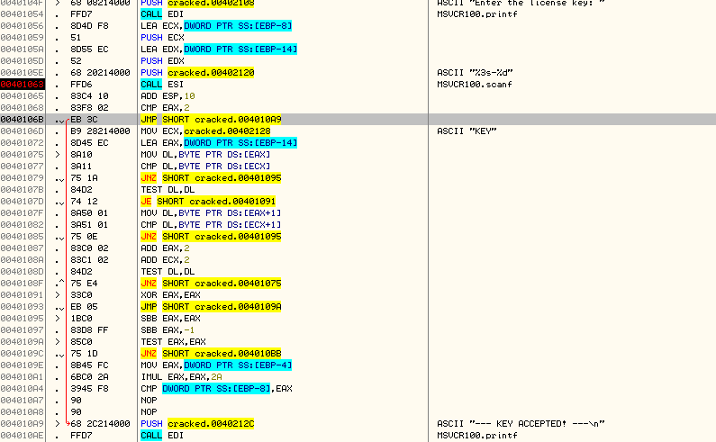
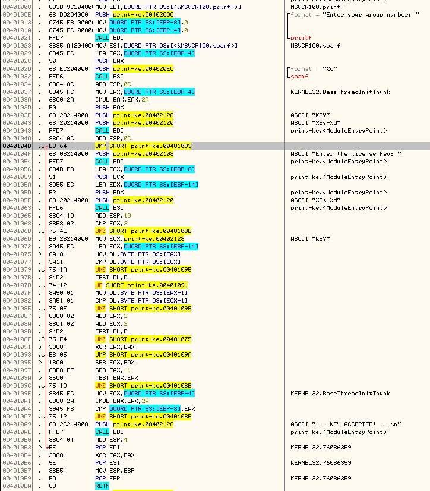

> Lorenzo De Bie

# Labo 1
## No multiplication
Already explained in the lab. Changed a JNZ after the CMP that checked if the number was equal to the multiplied group number to a NOP. Which made sure we always printed the `"--- KEY ACCEPTED! ---"`

## Cracked
Changed the JNZ instruction after the comparison of how much items were read by *scanf*. Instead of jumping to `"Invalid Key\n"`, I jump to the part where we print `"--- KEY ACCEPTED! ---"`. Now wathever we put in, the key will always be accepted.



## Printing the right key
This one required a bit more work.

1. After reading in the group number we have to multiply it by 42. The program saves the group number in [EBP-4].
   ```asm
    MOV EAX,DWORD PTR SS:[EBP-4]    ; group number -> EAX
    IMUL EAX,EAX,2A                 ; group number * 42
   ```
2. Now we have to push the arguments of printf on the stack in reverse order:
   * Group number * 42
   * String containing "KEY"
   * Format string "%s-%d"
  
   You could also change the format string to contain KEY already, but since the format string and a string containing "KEY" already exists in the data section I used them.

   ```asm
   PUSH EAX                         ; push group number * 42
   PUSH 00402128                    ; push "KEY"
   PUSH 00402120                    ; push format string
   ```
3. Now we can call printf, in the beginning of the program printf was stored inside EDI, so we can just call EDI. Don't forget to reset the stack afterward.
    ```asm
    CALL EDI                    ; call printf
    ADD ESP,0C                  ; reset stack
    ```
4. Since we have now done all we want in the program. We just jump to the end.
   ```asm
   JMP SHORT 00401B3                ; jump to ending
   ```

### The full program
