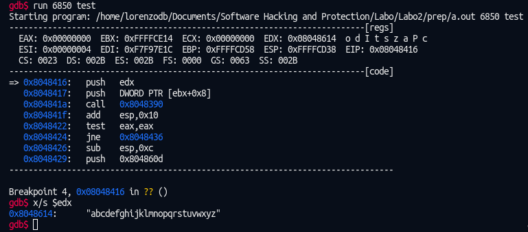

> Lorenzo De Bie

# Reverse-Engineering-a-Toy-Example
We have to find the arguments to pass to a binary so that it outputs "Hoera". To do this I used Ghidra (instead of IDA Pro) and gdb.

## Static Analysis with Ghidra
After analyzing the binary in Ghidra I took a look at the main function. After renaming some variables and changing some types I had this decompiled function.
```c
void main(int argc,char **argv)
{
  long student_number;
  int strcmp_res;
  
                    /* Check argc, print usage */
  if (argc != 3) {
    puts("invoke as a.out <last four digits UGent student nr> <string>");
                    /* WARNING: Subroutine does not return */
    exit(0);
  }
                    /* Convert string student number to long */
  student_number = strtol(argv[1],(char **)0x0,10);
  my_index = student_number % 0x19;
  strcmp_res = strncmp(argv[2],(char *)(my_index % 4 + *(int *)(strings + my_index * 4)),10);
  if (strcmp_res == 0) {
    puts("Hoera!");
  }
  return;
}
```
And the following ASM code:
```asm
                                 //
                                 // .text 
                                 // SHT_PROGBITS  [0x80483b0 - 0x80485b1]
                                 // ram: 080483b0-080485b1
                                 //
                                 *************************************************************************
                                 *                               FUNCTION                                *
                                 *************************************************************************
                                 undefined __cdecl main(int argc, char * * argv)
               undefined            AL:1             <RETURN>                                       XREF[2]:       080483f1(W), 
                                                                                                                   0804841a(W)  
               int                  Stack[0x4]:4     argc                                           XREF[2]:       080483b0(*), 
                                                                                                                   080483c6(*)  
               char * *             Stack[0x8]:4     argv                                           XREF[1]:       080483c3(R)  
               undefined4           EAX:4            student_number                                 XREF[1]:       080483f1(W)  
               undefined4           EAX:4            strcmp_res                                     XREF[1]:       0804841a(W)  
               undefined4           Stack[0x0]:4     local_res0                                     XREF[1]:       080483b7(R)  
               undefined1           Stack[-0x14]:1   local_14                                       XREF[1]:       08048436(*)  
               undefined4           Stack[-0x30]:4   local_30                                       XREF[1]:       080483d8(*)  
                                 main                                                    XREF[5]:       Entry Point(*), _start:08048458(*), 
                                                                                                         08048bf4, 08048c50(*), 
                                                                                                         _elfSectionHeaders::00000214(*)  
           080483b0 8d 4c 24 04       LEA          ECX=>argc,[ESP + 0x4]
           080483b4 83 e4 f0          AND          ESP,0xfffffff0
           080483b7 ff 71 fc          PUSH         dword ptr [ECX + local_res0]
           080483ba 55                PUSH         EBP
           080483bb 89 e5             MOV          EBP,ESP
           080483bd 56                PUSH         ESI
           080483be 53                PUSH         EBX
           080483bf 51                PUSH         ECX
           080483c0 83 ec 0c          SUB          ESP,0xc
           080483c3 8b 59 04          MOV          EBX,dword ptr [ECX + argv]
                                 Check argc, print usage
           080483c6 83 39 03          CMP          dword ptr [ECX]=>argc,0x3
           080483c9 74 19             JZ           LAB_080483e4
           080483cb 83 ec 0c          SUB          ESP,0xc
           080483ce 68 d0 85 04       PUSH         s_invoke_as_a.out_<last_four_digit_080485d0              = "invoke as a.out <last four digits U
                    08
           080483d3 e8 78 ff ff       CALL         puts                                                     int puts(char * __s)
                    ff
           080483d8 c7 04 24 00       MOV          dword ptr [ESP]=>local_30,0x0
                    00 00 00
           080483df e8 8c ff ff       CALL         exit                                                     void exit(int __status)
                    ff
                                 -- Flow Override: CALL_RETURN (CALL_TERMINATOR)
                                 LAB_080483e4                                            XREF[1]:       080483c9(j)  
           080483e4 50                PUSH         EAX
           080483e5 be 19 00 00       MOV          ESI,0x19
                    00
           080483ea 6a 0a             PUSH         0xa
           080483ec 6a 00             PUSH         0x0
           080483ee ff 73 04          PUSH         dword ptr [EBX + 0x4]
                                 Convert string student number to long
           080483f1 e8 aa ff ff       CALL         strtol                                                   long strtol(char * __nptr, char * * __
                    ff
           080483f6 83 c4 0c          ADD          ESP,0xc
           080483f9 6a 0a             PUSH         0xa
                                 extend eax sing bit into edx
           080483fb 99                CDQ
                                 EDX:EAX / ESI. EDX = remainder, EAX = quotient
           080483fc f7 fe             IDIV         ESI
           080483fe 66 be 04 00       MOV          SI,0x4
                                 student_number = student_number % 0x19
           08048402 89 d0             MOV          student_number,EDX
                                 set ECX = remainder
           08048404 89 d1             MOV          ECX,EDX
                                 set my_index = remainder?
           08048406 89 15 94 a0       MOV          dword ptr [my_index],EDX                                 = ??
                    04 08
                                 extend eax sign bit into edx
           0804840c 99                CDQ
           0804840d f7 fe             IDIV         ESI
           0804840f 03 14 8d 2c       ADD          EDX,dword ptr [ECX*0x4 + strings]                        = 
                    a0 04 08
           08048416 52                PUSH         EDX
           08048417 ff 73 08          PUSH         dword ptr [EBX + 0x8]
           0804841a e8 71 ff ff       CALL         strncmp                                                  int strncmp(char * __s1, char * __s2, 
                    ff
           0804841f 83 c4 10          ADD          ESP,0x10
           08048422 85 c0             TEST         strcmp_res,strcmp_res
           08048424 75 10             JNZ          LAB_08048436
           08048426 83 ec 0c          SUB          ESP,0xc
           08048429 68 0d 86 04       PUSH         s_Hoera!_0804860d                                        = "Hoera!"
                    08
           0804842e e8 1d ff ff       CALL         puts                                                     int puts(char * __s)
                    ff
           08048433 83 c4 10          ADD          ESP,0x10
                                 LAB_08048436                                            XREF[1]:       08048424(j)  
           08048436 8d 65 f4          LEA          ESP=>local_14,[EBP + -0xc]
           08048439 59                POP          ECX
           0804843a 5b                POP          EBX
           0804843b 5e                POP          ESI
           0804843c 5d                POP          EBP
           0804843d 8d 61 fc          LEA          ESP,[ECX + -0x4]
           08048440 c3                RET

```
The code which constructs to right key, was a little difficult to analyze statically, but it seems like they calculate an index based on your student number and use it to get a key from an array.

Let's see if this is any easier to analyze in gdb.

## Dynamic analysis & debugging
After opening the file in gdb I placed a breakpoint after the `strtol` function, at address *0x080483f9 using `break *0x80483f9`. After going through the program a couple of times and inspecting some stack adresses it seemed that i needed to know the content of [edx] right before the call to `strncmp`. So I placed a breakpoint there: `break *0x08048416`.

Now after running the program it we can inspect the memory at [edx]: `x/s $edx` and it shows us the key:



Now we try running the binary without gdb: `./a.out 6850 abcdefghijklmnopqrstuvwxyz`


**Task completed!**

I tried running it in gdb with some other numbers and it confirmed my thoughts that the binary uses the student number (after some mathematic operations on it) as an index to get a key.